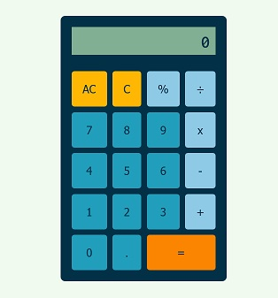

# Calculator

A simple calculator, as part of the [Odin Project](https://www.theodinproject.com/lessons/foundations-calculator) curriculum

## Summary

- Performs basic arithmetic operations and calculates percentages
- Has buttons that allow you to delete all or delete digits one by one
- Can be used with either mouse or keyboard

## Built With

- HTML
- CSS
- JavaScript

## Live Preview

🖥️ [View Live Demo](https://noasalgado.github.io/Calculator/)
